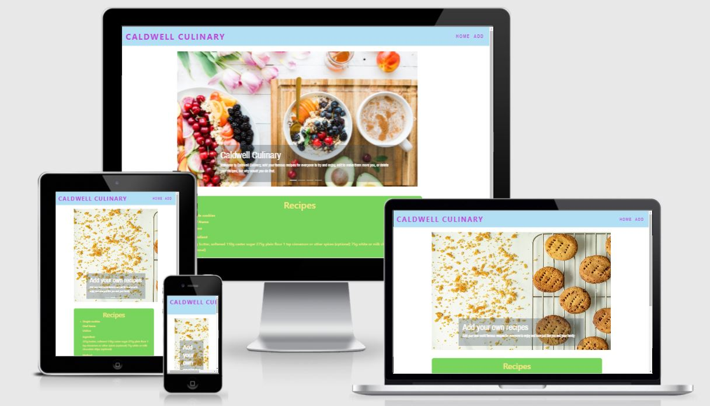

<h1 align="center">Caldwell Culinary </h1>
<h1 align="center"></h1>

## About
The website I developed is a recipe sharing site where users can upload their favourite recipes, make any changes, or take them off the site. They will also be able to see other recipes shared by other users.

## Table of Contents
1. [User Experience (UX)](#user-experience)
    1. [User Stories](#user-stories)
    1. [Design](#design)
        - [Color sheme](#color-scheme)
        - [Typography](#typography)
        - [Imagery](#imagery)
        - [Wireframes](#wireframes)

2. [Features](#features)

3. [Technologies Used](#technologies-used)

4. [Testing & Difficulties](#testing&difficulties)

5. [Deployment](#deployment)

6. [Credits](#credits)

## User Experience (UX)

### User Stories
    1. Users just wanting to look for recipes would use the directory on the home page
    2. Users who want to add a recipe would navigate to the add recipe page and fill out the form presented
    3. Users will also be able to edit recipes on the edit page, similar to the home page the saved recipes will be diplayed and there will be an option to edit
    4. Similar to the edit page the delete page will have the recipes displayed but with the option to delete

### Design

#### Colour Scheme
I didn't want anything too sharp on the site so I chose pastel colours as I though they would be easier on the eye. I used https://www.schemecolor.com/color/pastel and picked different colours I thought worked from different colour themes.

#### Typography
The font used on the site is Archivo Narrow with sans-serif as a backup. The font was taken from Google fonts (https://fonts.google.com/specimen/Archivo+Narrow?query=Archivo+Narrow). I thought that the font was clear and easy to read and would be perfect for a recipe webiste.

#### Imagery
Imagery used was just simple images taken from stock photo website (https://unsplash.com/). The purpose is for mainly aesthetic for the carousel to illustrate the options that the users have on the site.

#### Wireframes
Wireframes were created using Balsamiq, https://github.com/Stephen-Caldwell/Milestone-Project-3/blob/main/static/assets/wireframe

## Features
The features of the website are pretty simple:
- User's can view recipes - This will display recipes from the database
- Add recipes - Through a form will allow user's to add thir own recipes
- Edit recipes - Select from the list of recipes which one to edit
- Delete recipes - Select from the list of recipes which one to delete

## Technologies used
- HTML
    - Used to structure the website
- CSS
    - Styling of the website
- Bootstrap
    - Further styling and carousel
- Javascript
    - For Bootstrap functionality
- MongoDB 
    - Store and retrieve data submitted from forms
- Python
    - Language used for backend code
- Flask
    - Used to connect python to the front end with the HTML templates
- Balsamiq
    - Used to create the wireframes

## Testing & Difficulties
### Functionality
- NavBar
    - When the logo 'Caldwell Culinary' located on the right hand side of the navigation bar is clicked, it brings the user to the Home Page. This has been tested on desktop, tablet, and mobile views and from all pages.
    - All links in the navbar are working and have been tested.
    - The navigation bar stays at the top of the page on all screen sizes.
- Carousel
    - Automatically cycles through images displaying some text in the corners of the images
    - Working on all screen sizes
- Display
    - Display on home page reads the database and retrieves the information displaying it in the display box
    - Working on all screen sizes
- Edit Button
    - Displays correctly under each recipe
    - Directs user to Edit form page
- Delete Button
    - Displays correctly under each recipe
    - Deletes the correct recipe when clicked
- Add Page
    - Form appears and behaves as expected 
    - Submit button calls the correct function, reading the inputted data and send it to the database correctly 
- Edit Page
    - Form appears and behaves as expected
    - Form is pre-populated with the correct information of the recipe selected
    - Allows editting of the inputs
    - Submit button takes the updated information and sends the new information correctly updating the database

## Difficulties
The main difficulties I faced were with the database and the functionality surrounding that. It took a long time and help to get it right, eventually getting it right changed how I wanted the website to originally look.
In the future I would add search and filter functionalities to make the website more user friendly and intuitive.

## Deployment
#### Heroku
I have the site delpoyed through Heroku, https://caldwell-culinary.herokuapp.com/, However I am getting a build error and I am unsure as to why this is happening.

I was successful in deploying locally using Flask. I have uploaded a video of the site working in it's current state. 